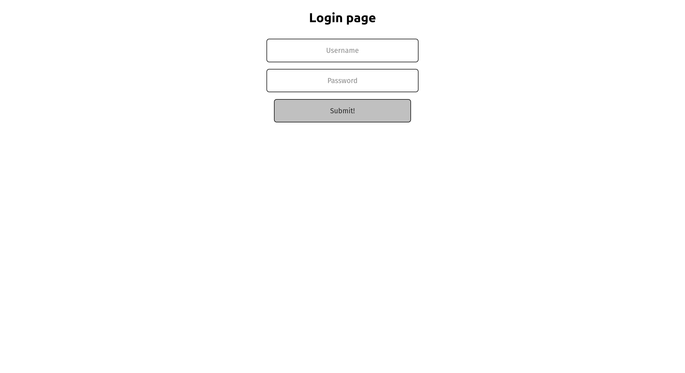
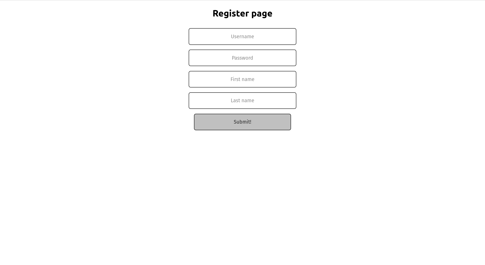
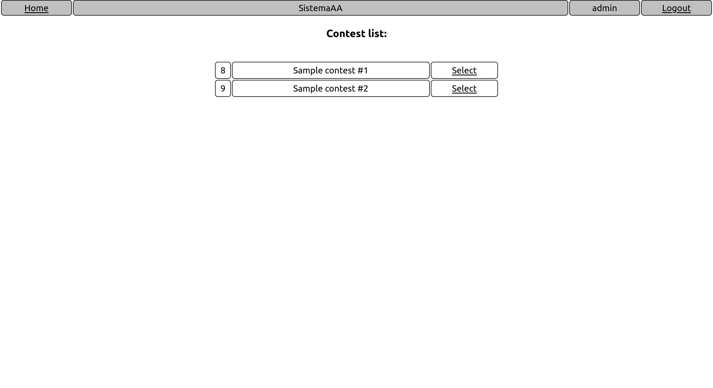
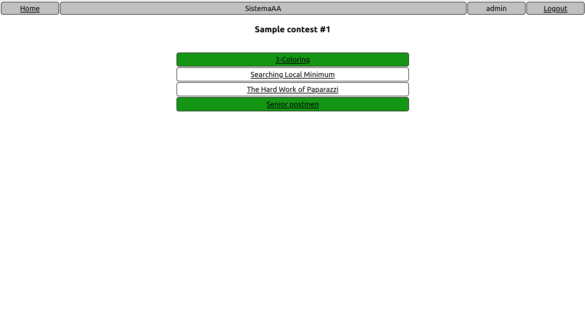
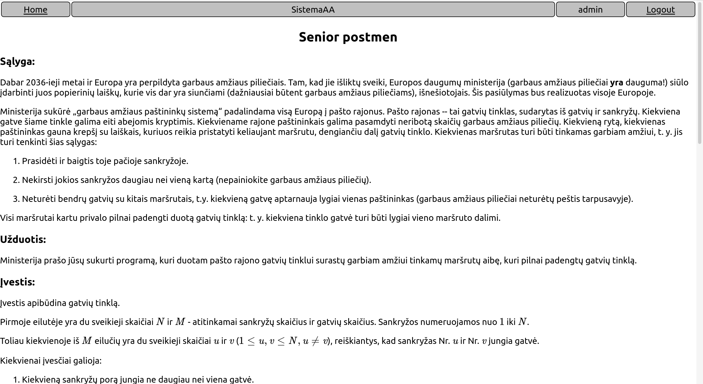
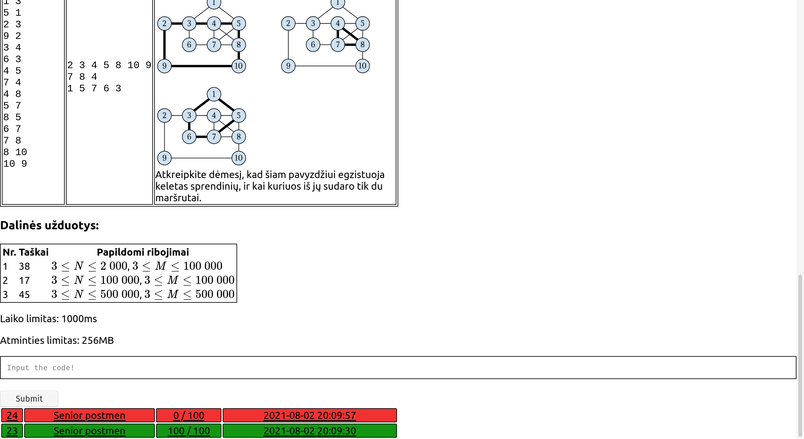
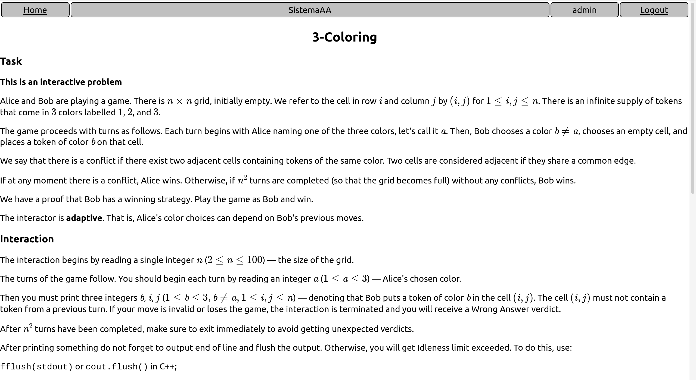
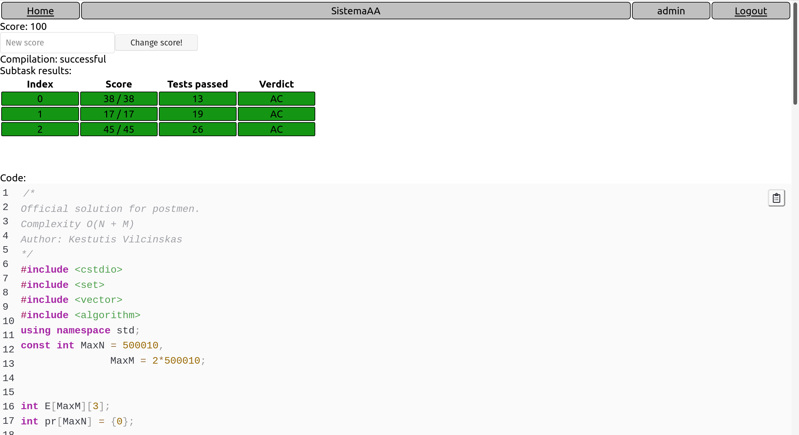
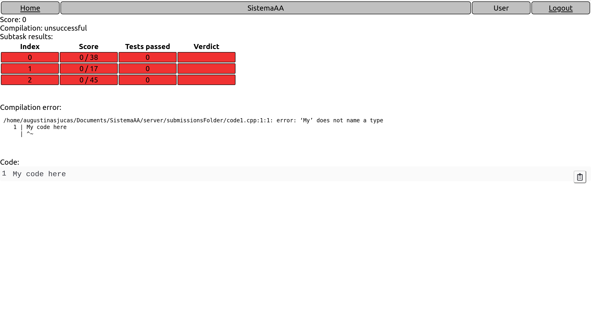

# Code Evaluation System

## What is this system for?

In this system, one can create and store competitive programming tasks. Each task consist
- a statement of the task; 
- tests which validate the correctness of some possible solution to the task; 
- [optional] a checker program, which tests whether the solution to the problem was correct). 

The system is capable of:
- displaying the statement of the task; 
- receiving the solutions to the task, compiling them and running them against the tests, provided by the creator of the task. 

In short, you can create competitive programming tasks, add tests and checkers for them and have the submissions be evaluated in the back-end server.

## Installation

Clone or download the repository. Then do the following:

### Downloading all the node_modules
Just type `npm install && cd client && npm install && npm run build`.

### Installing  the database
1. Type `sudo apt install postgresql postgresql-contrib`.
2. Go to `example_dbPool.js`, copy it and create a new file `dbPool.js`, then change the password (inside of this file) to the password of your PC.
3. Connect to the database server: `sudo -u postgres -i`.
4. Type into the terminal `psql`.
5. Create the neccessary DB: `CREATE DATABASE codeevaluationdb;`.
6. In order to connect to DB, type: `\c codeevaluationdb`.
7. Locate the db_schemes.sql file in /server folder and type: `\i /home/USERNAME/SistemaAA/server/db_scheme.sql`

### Starting the back-end server
Type into the terminal: `npm start`.

### Starting the client server
Just type in `cd client && npm start`.

Then the client will be on `localhost:3000` and the server on `localhost:3001`

## Screenshots

